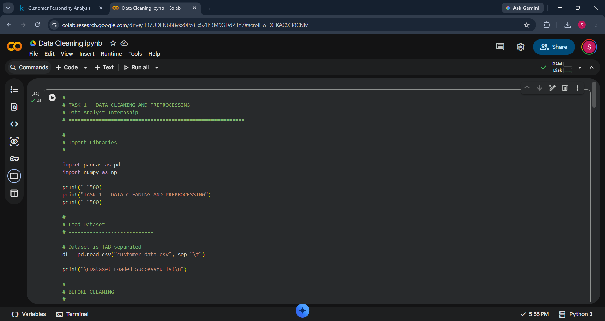
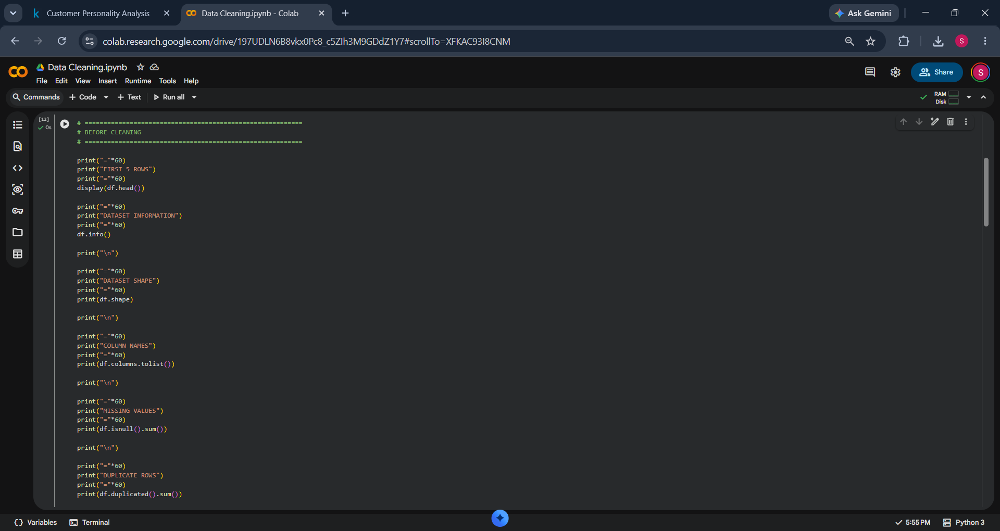
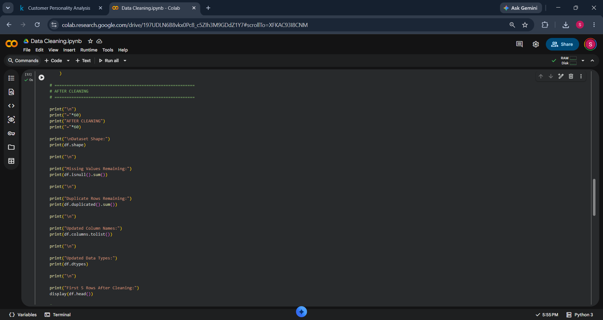
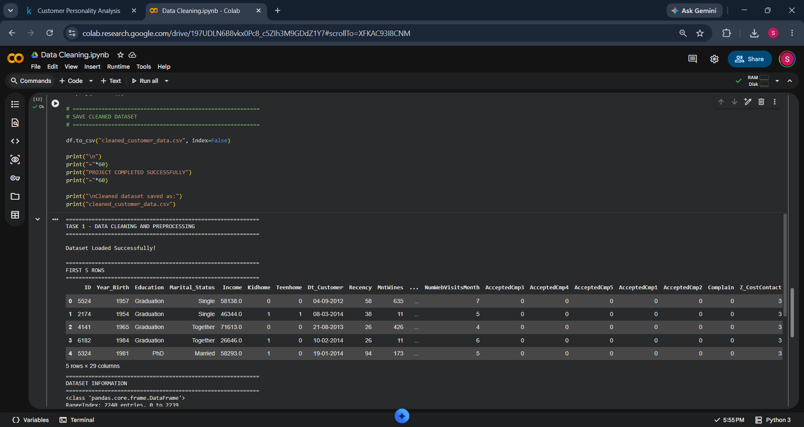
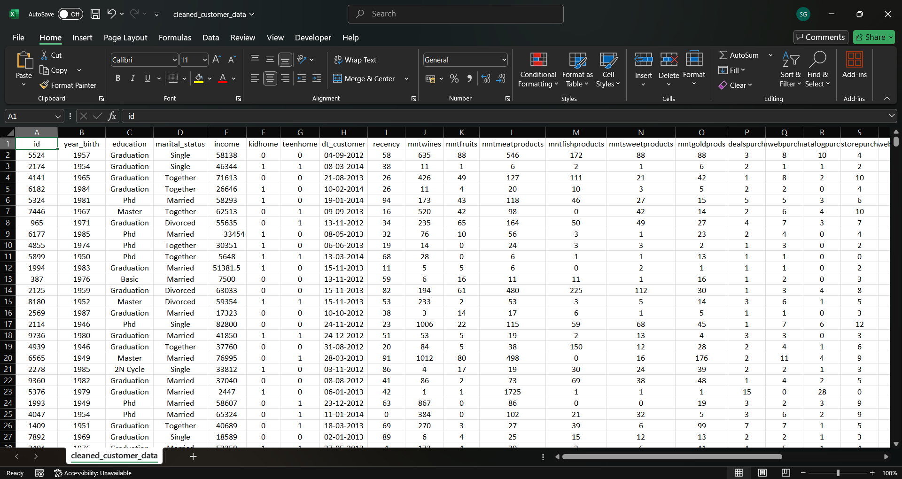

# 🧹 Data Cleaning and Preprocessing using Python

## 📌 Project Overview

This project demonstrates the complete data cleaning and preprocessing workflow using Python and Pandas.

The dataset was cleaned by:

- Handling missing values
- Removing duplicate rows
- Standardizing text values
- Converting date columns
- Renaming columns
- Saving a cleaned dataset

---

## 📂 Dataset

Customer Personality Analysis Dataset

Files:

- customer_data.csv
- cleaned_customer_data.csv

---

## 🛠 Technologies Used

- Python
- Pandas
- NumPy
- Google Colab
- GitHub

---

## ✅ Data Cleaning Steps

✔ Imported dataset

✔ Checked dataset information

✔ Checked missing values

✔ Removed duplicate rows

✔ Filled missing values

✔ Standardized text columns

✔ Converted date column

✔ Renamed columns

✔ Saved cleaned dataset

---

## 📸 Project Screenshots

### Dataset Loaded



---

### Missing Values



---

### After Cleaning



---

### Project Completed



---

### Cleaned Dataset



---

## 📁 Project Structure

```text
Data-Cleaning-and-Preprocessing
│
├── customer_data.csv
├── cleaned_customer_data.csv
├── DataCleaning.ipynb
├── README.md
│
└── screenshots
      ├── 1_dataset_loaded.png
      ├── 2_missing_values.png
      ├── 3_after_cleaning.png
      ├── 4_completed.png
      └── 5_cleaned_dataset.png
```

---

## 🎯 Outcome

The dataset was successfully cleaned and prepared for further analysis.

---

## 👨‍💻 Author

Samarth Gangawane

Data Analyst Intern
